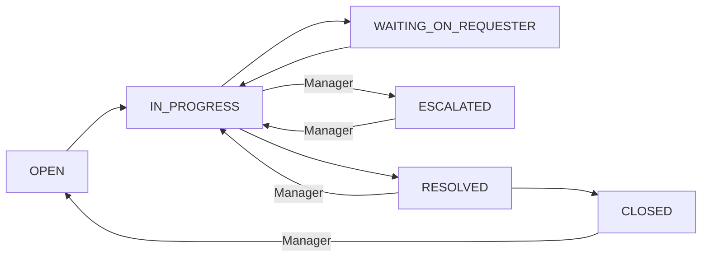

# Architecture

The technical brief: a guided tour of the seven decisions that carry most of this codebase, each section stating the choice, the reasoning, and the trade-off accepted, with file paths throughout. The seven: no separate API layer (Server Actions call a service layer that calls Prisma), tenant isolation enforced per query in the service layer, ticket status as a role-gated state machine with an atomic audit trail, stateless JWT sessions with no session table, attachments stored in Postgres with browser-side compression, a unit suite that mocks Prisma so CI runs without a database, and deployment as one standalone container on Railway. [docs/SPEC.md](docs/SPEC.md) is the full engineering design doc with the data model, permission matrix, route map, and decision log; this file is the shorter read.

## No separate API layer

Every mutation is a Next.js Server Action, and every Server Action follows the same shape: authenticate, delegate to a service function, map typed errors to a result. The services in [`src/lib/tickets/service.ts`](src/lib/tickets/service.ts), [`src/lib/users/service.ts`](src/lib/users/service.ts), [`src/lib/categories/service.ts`](src/lib/categories/service.ts), [`src/lib/teams/service.ts`](src/lib/teams/service.ts), [`src/lib/admin/service.ts`](src/lib/admin/service.ts), and [`src/lib/attachments/service.ts`](src/lib/attachments/service.ts) are the only code that touches Prisma; no action or component queries the database directly.

The reasoning: a REST layer between the UI and the business rules would exist only to serialize arguments this app never sends anywhere else, and colocating mutations with the pages that trigger them removes an entire class of contract drift. The service functions take an `unknown` input plus a `SessionPayload` and validate with Zod at the boundary ([`src/lib/tickets/service.ts`](src/lib/tickets/service.ts), the schema constants at the top), so the validated types flow through the rest of the function. Errors are typed classes, `AuthenticationError` (401) and `AuthorizationError` (403) in [`src/lib/auth/assertions.ts`](src/lib/auth/assertions.ts), which actions convert to user-facing messages instead of leaking stack traces.

The trade-off: there is no public API. A mobile client or a third-party integration would need an API layer built for it, and the service layer is deliberately shaped so that layer could be added without touching business rules. The one conventional route handler that does exist, [`src/app/api/attachments/[id]/route.ts`](src/app/api/attachments/%5Bid%5D/route.ts), is there because file bytes need `Content-Type` headers a Server Action cannot produce.

## Tenant isolation is a service-layer discipline

Every piece of data hangs off a `Team` ([`prisma/schema.prisma`](prisma/schema.prisma)), and the boundary is enforced twice on every path: the query itself includes the session's `teamId` in the `where` clause, and any fetch-by-id path re-asserts ownership with `assertSameTeam` or `assertCanViewTicket` from [`src/lib/auth/assertions.ts`](src/lib/auth/assertions.ts). The session is the only authority: `teamId`, `userId`, and `role` come from the server-side JWT on every mutation, and the Zod schemas accept only what the client legitimately controls, so no crafted `FormData` can name a foreign team. Compound indexes back the access pattern (`@@index([teamId, status])`, `@@index([teamId, assigneeId])` on `Ticket`).

The alternative was PostgreSQL row-level security. RLS moves the guarantee into the database, but it ties the app to session-variable plumbing on every connection and hides the rule from the code a reviewer actually reads. Keeping the rule in the service layer keeps it greppable and unit-testable: the isolation tests in [`src/lib/tickets/service.test.ts`](src/lib/tickets/service.test.ts) and its siblings assert the cross-team rejection paths directly, and [`e2e/isolation.spec.ts`](e2e/isolation.spec.ts) proves it end to end with two seeded teams.

The trade-off is that discipline can slip where a guarantee cannot. A self-audit found exactly one such gap: the top-assignees query in [`src/lib/admin/service.ts`](src/lib/admin/service.ts) fetched users by id without an explicit `teamId` filter, safe in practice because the ids came from a team-scoped query, but an implicit dependency. The filter was added to make isolation unconditional, and the incident is why every new query gets the `teamId` clause even when it looks redundant.

## Ticket status is a role-gated state machine

[`src/lib/tickets/fsm.ts`](src/lib/tickets/fsm.ts) is the whole machine: a `TRANSITIONS` array of `{from, to, minRole}` rows, a role ranking, and two functions. `assertTransition` throws on an invalid pair or an insufficient role; `getAllowedTransitions` feeds the UI so buttons for illegal moves never render. No state-machine library: nine transitions with one attribute each do not need a DSL, and the table reads in one pass.

Unlabelled edges require Support or higher; labelled edges require Manager or higher, so escalation, un-escalation, reopening a resolved ticket, and reopening a closed one are management calls by construction, not by convention in the UI.

The write path makes the audit trail complete: `transitionStatus` in [`src/lib/tickets/service.ts`](src/lib/tickets/service.ts) writes the status update and a `StatusEvent` row inside one Prisma `$transaction`, so either both land or neither does, and a ticket can never appear to jump states with no recorded cause. The client applies the change optimistically with `useOptimistic` ([`src/app/desk/[id]/StatusForm.tsx`](src/app/desk/%5Bid%5D/StatusForm.tsx)) and reverts when the action rejects. The trade-off of the plain-table approach: side effects of a transition have no callback hook, so anything that should happen on a status change must be written explicitly in the service function, which is where this codebase wants such logic anyway.

## Stateless JWT sessions, no session table

Auth is Auth.js v5 with a single Credentials provider ([`src/auth.ts`](src/auth.ts)): team slug plus email plus bcrypt-checked password, where the slug is part of identity because email is unique per team, not globally (`@@unique([teamId, email])`). The JWT callback in [`src/auth.config.ts`](src/auth.config.ts) embeds `teamId`, `role`, and `requesterType`, so authorization decisions need no user lookup per request. There is no session table at all.

Route guards live in [`src/proxy.ts`](src/proxy.ts), Next.js 16's renamed `middleware.ts`: `/desk/*` requires Support or higher, `/admin/*` Manager or higher, `/super/*` Super only, `/tickets/*` Requester only, and authenticated users are redirected from `/login` to their role's home. The guards are first-line UX, not the security boundary; every service function re-asserts on its own, so a request that slips past the proxy still hits a 403 in the service layer. Login is rate limited before any bcrypt work begins ([`src/app/login/actions.ts`](src/app/login/actions.ts)), an in-process sliding window that is correct here only because [railway.json](railway.json) pins `numReplicas` to 1; a second replica would need a shared store.

Two honest limits. First, revocation: after a password change, the old JWT is technically still valid, and rather than adding a `passwordChangedAt` check on every request, the client signs out ([`src/app/profile/ChangePasswordForm.tsx`](src/app/profile/ChangePasswordForm.tsx)), which clears the `httpOnly` cookie but would not stop an attacker who had already exfiltrated the token before its natural expiry. Second, the production lesson: behind Railway's TLS-terminating load balancer, Auth.js could not resolve the real HTTPS origin and bounced every successful login back to the form until `trustHost: true` was set in [`src/auth.config.ts`](src/auth.config.ts). One line, but the diagnosis required understanding how Auth.js validates redirect URLs behind a reverse proxy.

## Attachments live in Postgres, compressed in the browser

Uploads are `Bytes` columns on the `Attachment` model ([`prisma/schema.prisma`](prisma/schema.prisma)), not an object store. The pipeline starts client-side: [`src/lib/attachments/compress.ts`](src/lib/attachments/compress.ts) redraws images through a canvas to WebP, first probing `canvas.toBlob('image/webp')` because Safari silently produces PNG there and the code falls back to JPEG. The server trusts none of it: [`src/lib/attachments/service.ts`](src/lib/attachments/service.ts) independently enforces a four-entry MIME allowlist (JPEG, PNG, WebP, PDF) and a 1 MB cap before any write. The allowlist is a security control, not a convenience: the serve route ([`src/app/api/attachments/[id]/route.ts`](src/app/api/attachments/%5Bid%5D/route.ts)) echoes the stored `Content-Type`, so accepting arbitrary MIME types would let an attacker store HTML and have it rendered from the app's origin. The route also runs `assertCanViewTicket` and marks responses `Cache-Control: private`.

The reasoning for `bytea` over S3-style storage: one database means one backup, one connection string, and tenant isolation for files falls out of the same ticket assertion as everything else, with no signed-URL machinery. Uploads ride Server Actions, which required raising `serverActions.bodySizeLimit` to 3 MB in [`next.config.ts`](next.config.ts) because the 1 MB default rejects larger multipart bodies before the action even runs.

The trade-off is a deliberate ceiling: `bytea` at 1 MB per file is fine for screenshots and PDFs on a support ticket, and there is no per-team quota beyond the per-file cap, so a production system at real scale would move bytes to object storage. The service layer is the single choke point where that swap would happen.

## The unit suite mocks Prisma, so CI has no database

All 234 Vitest tests stub the Prisma client with `vi.mock("@/lib/db")` (see the top of [`src/lib/tickets/service.test.ts`](src/lib/tickets/service.test.ts)), asserting on the business rules: FSM edges and role gates ([`src/lib/tickets/fsm.test.ts`](src/lib/tickets/fsm.test.ts)), every assertion path ([`src/lib/auth/assertions.test.ts`](src/lib/auth/assertions.test.ts)), cross-team rejections, Zod branches, role ceilings, and metric computations across every service domain. The suite runs in under two seconds, and CI ([`.github/workflows/ci.yml`](.github/workflows/ci.yml)) is a single job with no Postgres service container: lint, `tsc --noEmit`, the unit suite, and a production build with a dummy `DATABASE_URL`, which works because the build never queries the database.

What mocked tests cannot see, real-browser tests cover: the Playwright suite ([`e2e/`](e2e)) runs role-by-role journeys against a real dev server and the seeded Docker Postgres, including two-team isolation ([`e2e/isolation.spec.ts`](e2e/isolation.spec.ts)) and the login rate limiter ([`e2e/login-rate-limit.spec.ts`](e2e/login-rate-limit.spec.ts)). [`e2e/global-setup.ts`](e2e/global-setup.ts) resets the seed tickets between runs so the suite is repeatable, and [`playwright.config.ts`](playwright.config.ts) disables the rate limiter for the tests that are not about it.

The trade-off: mocked unit tests prove the logic but not the SQL, so a wrong index or an invalid Prisma query shape only surfaces in E2E or production, and the E2E suite is not part of the CI workflow; it runs locally against the Docker Postgres. That is the accepted cost of a CI feedback loop measured in seconds.

## One standalone container on Railway

The app deploys as a single container next to a Railway-managed PostgreSQL, configured entirely by [railway.json](railway.json): Railpack builder, one replica pinned to `asia-southeast1`, restart on failure. The build uses Next.js `output: "standalone"` ([`next.config.ts`](next.config.ts)) so only the production closure ships, with `.next/static` and `public/` copied into the standalone tree at build time because the standalone server does not serve them from their source locations. `HOSTNAME=0.0.0.0` in the start command makes the Node server bind beyond localhost, and security headers (HSTS, `X-Frame-Options: DENY`, `nosniff`, referrer policy) are applied to every response from [`next.config.ts`](next.config.ts).

Migrations run as a `preDeployCommand` (`npx prisma migrate deploy`): the old container keeps serving until migrations succeed and the new container passes its health check, so a failed migration aborts the deploy instead of taking the site down. The trade-off of the single-replica, in-process design: no horizontal scaling without first moving the rate-limit counters out of process memory, and a redeploy resets those counters. For a portfolio-scale deployment that trade is taken knowingly; the seams to change it are one file each.
